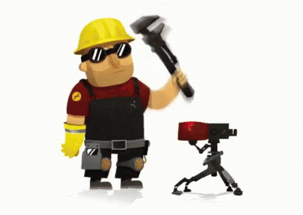

`<h1 align="center">Hi 👋, I'm Nhan Hoang</h1>
<h3 align="center">Dedicated 4th-year Mechanical Engineering Major with a Passion for Innovation at UF</h3>

  

- 🔭 I’m currently working on **ASM GatorSense Design Project**

- 🌱 I’m currently learning **Python to model and design next-generation neural interfaces for the control state-of-the-art prosthetic**

- 📫 How to reach me **nhanhoang0815@gmail.com**
  

## Skills

